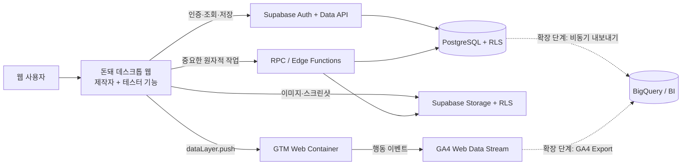

# 돈돼 웹 서비스 데이터 파이프라인 설계 리서치

> 문서 상태: 제안안 v1.0
> 작성일: 2026-09-07
> 대상: 기획, 프론트엔드, 백엔드, 데이터 분석 담당자
> 적용 범위: `creator-web` 기반 데스크톱 웹 단일 MVP

## 1. 결론 요약

돈돼의 웹 MVP에는 다음 조합을 권장한다.

- **서비스 루트**: `creator-web/` (`creator-web/index.html`이 실제 진입 파일)
- **Supabase**: 인증, 서비스 운영 데이터, 파일, 트랜잭션, 권한 관리
- **Google Tag Manager(GTM)**: 웹의 행동 이벤트 수집 규칙과 태그 배포 관리
- **Google Analytics 4(GA4)**: 유입, 행동 퍼널, 전환, 리텐션 분석
- **BigQuery**: MVP에서는 도입하지 않고, 원시 이벤트 결합 분석이 필요해질 때 추가
- **Firebase**: 네이티브 iOS/Android 앱 또는 Firebase 전용 기능이 필요해질 때 재검토

핵심 원칙은 다음과 같다.

1. Supabase를 서비스 데이터의 **원본(Source of Truth)** 으로 사용한다.
2. GA4는 추세와 행동 분석에 사용하며 결제, 코인 잔액, 투표 수의 원장으로 사용하지 않는다.
3. 저장 작업이 성공한 뒤에만 성공 이벤트를 GA4로 전송한다.
4. 이메일, 닉네임, 리뷰 원문, 설문 주관식 답변은 GA4로 보내지 않는다.
5. 현재 화면 전환 방식에는 수동 가상 페이지뷰가 필요하다.

## 2. 현재 프로토타입 진단

현재 저장소는 서버 없이 실행되는 정적 HTML 프로토타입이다. 2026-09-07 결정에 따라 `creator-web/`을 실제 서비스 루트로 사용하며, 제작자와 테스터 기능을 하나의 데스크톱 웹에 통합한다.

- `creator-web/index.html`: 실제 서비스 진입 파일이자 데스크톱 웹 UI 기준
- `index(mode).html`: 과거 제작자/테스터 진입 포털 참고용
- `tester-mobile/index.html`: 과거 모바일 UI와 참여 플로우 참고용

제작자 화면은 `landing`, `explore`, `create`, `post`, `abtest`, `feedback`, `market`, `mypage`를 하나의 HTML 안에서 전환한다. 화면 전환은 [`navigateTo()`](../creator-web/index.html#L4661)가 DOM의 표시 상태를 바꾸는 방식이다.

`tester-mobile/index.html`에는 `landing`, `dashboard`, `post-detail`, `abtest`, `external-service`, `review-form`, `reward-success`, `mypage`, `market` 흐름이 구현되어 있지만 배포 대상은 아니다. 이 중 필요한 참여·리뷰·보상 흐름만 `creator-web`의 데스크톱 UI로 옮긴다.

현재 데이터는 브라우저 메모리의 객체와 변수에 보관된다. 예를 들어 제작자의 테스트 등록 값은 `testCreationStore`에 들어가며, 테스터의 투표와 코인 지급도 자바스크립트 변수 변경으로 처리된다. 새로고침, 다중 사용자, 동시 요청, 권한 제어를 지원하려면 영속 저장소와 서버 측 원자적 처리가 필요하다.

또한 실제 URL이 바뀌지 않으므로 기본 페이지 로드만 측정하면 화면별 방문을 알 수 없다. Google도 SPA처럼 동적으로 화면이 바뀌는 서비스는 History API 또는 사용자 정의 이벤트로 가상 페이지뷰를 발생시키고 DebugView에서 검증하도록 안내한다. 이 프로젝트는 현재 History API를 사용하지 않으므로 **사용자 정의 가상 페이지뷰 방식**이 알맞다.

## 3. 검토한 선택지

| 선택지 | 장점 | 단점 | 평가 |
|---|---|---|---|
| Supabase + GTM + GA4 | 운영 데이터와 행동 분석의 역할이 명확하고 현재 웹 구조에 적합 | 두 시스템 간 지표 정의와 검증 규칙이 필요 | **권장** |
| Firebase 전체 도입 + GA4 | 네이티브 앱, FCM, Crashlytics, Remote Config와 결합하기 좋음 | Supabase 계획과 기능이 중복되고 현재 웹 MVP에는 이점이 작음 | 네이티브 앱 단계에서 재검토 |
| Supabase만 사용해 모든 행동 로그 저장 | 데이터 통제와 SQL 분석이 쉬움 | 마케팅 유입·세션·기기·캠페인 분석을 직접 구현해야 함 | 운영 이벤트 보완용으로만 사용 |
| GA4만 사용 | 설치가 빠르고 행동 분석이 쉬움 | 정확한 원장, 데이터 수정, 관계형 조회, 서비스 권한 제어 불가 | 서비스 DB로 부적합 |

GA4는 하나의 속성 안에 웹, iOS, Android 데이터 스트림을 둘 수 있다. Google은 일반적인 구성으로 속성당 웹 스트림 1개와 플랫폼별 앱 스트림을 권장한다. 따라서 지금은 웹 스트림 하나로 시작하고, 네이티브 앱이 생기면 같은 GA4 속성에 Firebase 기반 앱 스트림을 추가하면 된다.

## 4. 목표 아키텍처



### 4.1 데이터 소유권

| 질문 | 기준 시스템 |
|---|---|
| 실제 회원과 역할은 누구인가? | Supabase Auth + `profiles` |
| 어떤 테스트가 현재 게시 중인가? | Supabase `experiments` |
| 특정 사용자가 실제로 투표했는가? | Supabase `ab_votes` |
| 리뷰 원문과 첨부 이미지는 무엇인가? | Supabase DB + Storage |
| 사용자의 정확한 코인 잔액은 얼마인가? | Supabase `coin_ledger` 합계 |
| 어느 유입 채널의 게시 전환율이 높은가? | GA4 |
| 테스트 상세에서 리뷰 제출까지 어디서 이탈하는가? | GA4 Funnel Exploration |
| 화면별 이용 추세와 재방문율은 어떠한가? | GA4 |

두 시스템의 수치가 다를 경우, 매출·코인·참여·투표·리뷰 건수는 항상 Supabase를 정답으로 판단한다. 브라우저 분석 이벤트는 네트워크 차단, 동의 거부, 광고 차단기 등의 이유로 누락될 수 있다.

## 5. Supabase 데이터 모델 제안

아래 모델은 MVP 기준이다. 모든 기본 키는 `uuid`, 모든 시간은 `timestamptz`, 금액과 코인은 정수형을 권장한다.

### 5.1 핵심 테이블

| 테이블 | 주요 필드 | 설명 |
|---|---|---|
| `profiles` | `id`, `role`, `display_name`, `created_at` | `auth.users.id`와 1:1. 공개 프로필 최소 정보만 보관 |
| `experiments` | `id`, `creator_id`, `type`, `title`, `description`, `service_url`, `status`, `reward_coin`, `target_count`, `published_at`, `closed_at` | 테스트의 중심 엔터티 |
| `experiment_variants` | `id`, `experiment_id`, `code`, `title`, `content`, `sort_order` | A/B 선택지. `code`는 A, B 등 |
| `experiment_tasks` | `id`, `experiment_id`, `instruction`, `sort_order` | 외부 서비스 체험 과제 |
| `experiment_questions` | `id`, `experiment_id`, `type`, `prompt`, `required`, `sort_order`, `options` | 설문 문항. 선택지는 제한된 `jsonb` 사용 가능 |
| `participations` | `id`, `experiment_id`, `tester_id`, `status`, `started_at`, `completed_at` | 테스트 참여 단위 |
| `ab_votes` | `id`, `participation_id`, `variant_id`, `opinion`, `created_at` | A/B 투표와 선택 이유 |
| `feedback_submissions` | `id`, `participation_id`, `rating`, `bug_level`, `review_text`, `screenshot_path`, `submitted_at` | 최종 피드백 헤더 |
| `feedback_answers` | `id`, `submission_id`, `question_id`, `answer` | 문항별 답변. 형식이 다양하면 `jsonb` 사용 |
| `coin_ledger` | `id`, `user_id`, `amount`, `reason`, `reference_type`, `reference_id`, `idempotency_key`, `created_at` | 코인 증감 불변 원장. 지급은 양수, 차감은 음수 |
| `reward_products` | `id`, `name`, `coin_price`, `stock`, `status` | 교환 가능한 상품 |
| `reward_redemptions` | `id`, `user_id`, `product_id`, `coin_amount`, `status`, `requested_at` | 상품 교환 신청 |
| `notification_jobs` | `id`, `experiment_id`, `type`, `status`, `scheduled_at`, `sent_at` | 업데이트 알림과 재시도 상태 |

### 5.2 필수 제약 조건

- `experiments.status`: `draft`, `published`, `closed`, `archived`로 제한
- `participations`: `(experiment_id, tester_id)`에 고유 제약
- `ab_votes`: `participation_id`에 고유 제약
- `feedback_submissions`: `participation_id`에 고유 제약
- `coin_ledger.idempotency_key`: 고유 제약
- `reward_coin`, `target_count`, `coin_price`, `stock`: 음수 방지 `CHECK`
- 모든 외래 키에 삭제 정책을 명시하고, 주요 조회 조건에 인덱스 추가

`profiles.coin_balance` 같은 수정 가능한 잔액 필드를 원장 없이 단독으로 두지 않는다. 기본값은 `coin_ledger.amount` 합계로 계산하고, 성능이 필요하면 캐시 잔액을 별도로 두되 원장과 트랜잭션 안에서 함께 갱신한다.

### 5.3 파일 저장

다음 버킷 구성을 권장한다.

- `experiment-assets`: 서비스 대표 이미지와 A/B 시안
- `feedback-screenshots`: 리뷰 첨부 화면
- `profile-images`: 사용자 프로필 이미지

객체 경로는 `{owner_user_id}/{experiment_id}/{uuid}.{ext}` 형태로 구성한다. 업로드 크기와 MIME 유형을 제한하고, 비공개 피드백 이미지는 공개 버킷에 넣지 않는다. Supabase Storage는 `storage.objects`의 RLS 정책으로 접근을 제어하며, 서비스 키는 RLS를 우회하므로 프론트엔드에 포함하면 안 된다.

Supabase의 데이터베이스 백업은 Storage 객체 자체를 포함하지 않는다. 운영 전에는 DB 백업과 별개로 파일 보존·복구 정책을 정해야 한다.

## 6. 핵심 쓰기 플로우와 트랜잭션

### 6.1 테스트 게시

```text
제작자 게시 요청
→ 입력·소유권 검증
→ 필요한 코인 계산
→ 중복 요청 확인
→ 코인 원장 차감
→ experiment 상태를 published로 변경
→ 트랜잭션 커밋
→ 웹에 성공 응답
→ dataLayer에 experiment_publish_success 전송
```

코인 차감과 게시 상태 변경은 하나의 PostgreSQL 함수/RPC 트랜잭션에서 처리해야 한다. 프론트엔드가 잔액을 직접 수정하거나 “결제 성공” 값을 보내는 구조는 허용하지 않는다.

### 6.2 투표 및 리뷰 보상

```text
테스터 제출 요청
→ 참여 상태·중복 제출 검증
→ 투표/리뷰 저장
→ 참여 완료 처리
→ idempotency_key 확인 후 코인 지급 원장 추가
→ 트랜잭션 커밋
→ 웹 성공 화면 표시
→ GA4 성공 이벤트 전송
```

참고용 모바일 프로토타입의 [`submitAbVote()`](../tester-mobile/index.html#L1911)와 [`submitReviewAndGoReward()`](../tester-mobile/index.html#L2138)는 메모리 변수에 코인을 즉시 더한다. 데스크톱 웹으로 기능을 옮길 때는 서버 트랜잭션의 반환값으로 잔액을 갱신해야 한다.

### 6.3 실제 결제 또는 상품 교환

- 결제 승인 여부는 클라이언트 콜백이 아니라 결제사 서버 웹훅을 기준으로 확정한다.
- 웹훅 서명 검증과 비밀 키 사용은 Supabase Edge Function 같은 서버 환경에서 처리한다.
- 웹훅과 교환 요청은 재전송될 수 있으므로 고유한 외부 거래 ID 또는 `idempotency_key`를 저장한다.
- 상품 재고 차감, 코인 차감, 교환 신청 생성은 하나의 트랜잭션으로 묶는다.

Supabase Database Webhooks는 `INSERT`, `UPDATE`, `DELETE` 이후 비동기로 외부 시스템을 호출할 수 있다. 알림·분석 내보내기처럼 본 거래를 막지 않아야 하는 후속 작업에 사용하고, 코인 지급처럼 반드시 함께 성공해야 하는 로직은 같은 DB 트랜잭션에 둔다.

## 7. GA4 이벤트 분류 체계

### 7.1 명명 원칙

- 영문 소문자 `snake_case` 사용
- “클릭”보다 비즈니스 의미를 표현
- 시작과 성공을 분리해 실패·이탈을 계산
- Google 권장 이벤트가 정확히 맞으면 권장 이름 사용
- 이벤트 의미가 바뀌면 이름을 재사용하지 말고 `event_schema_version`을 증가
- 오류 전문 대신 제한된 `error_code`만 전송

Google은 `login`, `sign_up`, `search`, `share`, `earn_virtual_currency` 등의 권장 이벤트를 제공한다. 의미가 맞는 경우 이 이름을 사용하면 표준 리포트와의 호환성이 좋아진다. 돈돼 고유 행동은 커스텀 이벤트로 정의한다.

### 7.2 공통 파라미터

| 파라미터 | 예시 | 규칙 |
|---|---|---|
| `event_schema_version` | `1` | 이벤트 계약 버전 |
| `surface` | `web` | 현재는 데스크톱 웹 단일 값 사용 |
| `feature_area` | `auth`, `experiment_create`, `participation` | 웹 안의 기능 영역 구분 |
| `user_role` | `creator`, `tester`, `anonymous` | 개인 식별 정보가 아닌 역할 |
| `screen_name` | `experiment_create` | 가상 화면 이름 |
| `experiment_id` | 임의 UUID | 테스트 단위 분석용. 제목은 보내지 않음 |
| `experiment_type` | `product`, `prototype`, `ab_test`, `landing` | 제한된 열거형 |
| `variant_code` | `a`, `b` | A/B 선택지. 자유 입력 금지 |
| `step_number` | `1` | 등록 단계 번호 |
| `reward_coin` | `50` | 숫자만 전송 |
| `error_code` | `insufficient_coin` | 사전에 정한 코드만 허용 |

이메일, 전화번호, 실명, 닉네임, 리뷰 원문, 설문 주관식 답변, 이미지 URL, 자유 입력 검색어는 기본적으로 제외한다. Google 정책은 GA에 개인 식별 정보를 보내지 않도록 요구하며, URL과 페이지 제목에도 개인 정보가 들어갈 수 있으므로 주의해야 한다.

### 7.3 제작자 퍼널 이벤트

| 순서 | 이벤트 | 발생 시점 | 주요 파라미터 | GA4 핵심 이벤트 후보 |
|---|---|---|---|---|
| 1 | `sign_up` | 가입 성공 | `method`, `surface` | 예 |
| 2 | `login` | 로그인 성공 | `method`, `surface` | 아니오 |
| 3 | `experiment_create_start` | 등록 시작 | `experiment_type` | 아니오 |
| 4 | `experiment_create_step_view` | 단계 표시 | `step_number` | 아니오 |
| 5 | `experiment_create_step_complete` | 단계 검증 통과 | `step_number` | 아니오 |
| 6 | `experiment_publish_start` | 게시 버튼 클릭 후 서버 요청 시작 | `reward_coin`, `target_count` | 아니오 |
| 7 | `experiment_publish_success` | DB 트랜잭션 성공 | `experiment_id`, `experiment_type` | **예** |
| 8 | `experiment_publish_error` | 게시 실패 | `error_code`, `step_number` | 아니오 |
| 9 | `share` | 테스트 공유 완료 | `method`, `content_type`, `item_id` | 아니오 |
| 10 | `feedback_dashboard_view` | 결과 대시보드 진입 | `experiment_id` | 아니오 |
| 11 | `tester_notification_send_success` | 알림 작업 접수 성공 | `experiment_id`, `notification_type` | 아니오 |

### 7.4 테스터 퍼널 이벤트

| 순서 | 이벤트 | 발생 시점 | 주요 파라미터 | GA4 핵심 이벤트 후보 |
|---|---|---|---|---|
| 1 | `experiment_list_view` | 피드 표시 | `filter_type` | 아니오 |
| 2 | `experiment_detail_view` | 상세 진입 | `experiment_id`, `experiment_type` | 아니오 |
| 3 | `participation_start` | 참여 조건 확인 및 서버 기록 성공 | `experiment_id` | 아니오 |
| 4 | `external_test_open` | 외부 서비스 이동 | `experiment_id` | 아니오 |
| 5 | `ab_vote_submit_success` | 투표 저장 성공 | `experiment_id`, `variant_code` | **예** |
| 6 | `review_start` | 리뷰 작성 화면 진입 | `experiment_id` | 아니오 |
| 7 | `review_submit_success` | 리뷰와 보상 트랜잭션 성공 | `experiment_id`, `has_screenshot` | **예** |
| 8 | `review_submit_error` | 제출 실패 | `error_code` | 아니오 |
| 9 | `earn_virtual_currency` | 코인 지급 확정 | `virtual_currency_name=don_coin`, `value` | 아니오 |
| 10 | `reward_redemption_start` | 교환 요청 시작 | `item_id`, `coin_amount` | 아니오 |
| 11 | `reward_redemption_success` | 교환 트랜잭션 성공 | `item_id`, `coin_amount` | **예** |

`earn_virtual_currency`는 보상 트랜잭션 성공과 함께 분석할 수 있지만, 실제 잔액은 반드시 `coin_ledger`로 계산한다.

### 7.5 가상 페이지뷰

현재 `navigateTo()` 호출이 실제 URL 변경을 만들지 않으므로 다음 계약을 사용한다.

```js
window.dataLayer = window.dataLayer || [];

function trackVirtualPage(viewKey, surface) {
  window.dataLayer.push({
    event: 'virtual_page_view',
    event_schema_version: 1,
    surface,
    screen_name: viewKey,
    page_title: `돈돼 | ${viewKey}`,
    page_location: `${location.origin}${location.pathname}#/${viewKey}`
  });
}
```

GTM에서는 `virtual_page_view` 사용자 정의 이벤트를 트리거로 삼아 GA4의 `page_view`를 전송한다. 자동 페이지뷰와 수동 페이지뷰가 함께 전송되어 중복되지 않도록 다음 두 방식 중 하나만 선택한다.

1. **권장**: 자동 페이지뷰를 끄고 최초 화면을 포함해 모든 화면 조회를 수동 전송
2. 최초 문서 로드는 자동 수집하고, 이후 `navigateTo()`만 수동 전송

이 프로젝트에서는 두 HTML의 초기화 과정에서도 `navigateTo()`가 호출될 수 있으므로 1번이 더 단순하고 검증하기 쉽다.

## 8. GTM 구현 설계

### 8.1 컨테이너 구성

- 같은 제품·운영 도메인이라면 GTM 웹 컨테이너 1개 사용
- GA4 속성 1개, 웹 데이터 스트림 1개 사용
- `surface=web`으로 통일하고 `feature_area`, `user_role`로 기능과 역할 구분
- 개발/스테이징 이벤트는 운영 데이터와 섞이지 않도록 별도 환경 또는 테스트 스트림 사용
- GTM 변경은 Preview 검증 후 버전명과 변경 설명을 작성해 게시

### 8.2 권장 태그와 트리거

| 구성 | 내용 |
|---|---|
| Google tag | 모든 허용된 페이지에서 기본 GA4 설정 로드 |
| Consent Initialization | 기본 동의 상태를 다른 태그보다 먼저 설정 |
| Virtual Page View 태그 | `virtual_page_view`를 GA4 `page_view`로 매핑 |
| Business Event 태그 | 승인된 사용자 정의 이벤트를 동일 이름으로 GA4에 전달 |
| 예외 트리거 | 로컬 개발, 내부 QA, 관리자 화면 필요 시 제외 |

GTM의 데이터 레이어는 웹 애플리케이션과 태그 사이의 계약이다. 화면 코드가 GA4 태그 세부 설정을 직접 알지 않도록 하고, 안정된 데이터 레이어만 제공한다.

### 8.3 공통 추적 함수

```js
function trackEvent(eventName, params = {}) {
  window.dataLayer = window.dataLayer || [];
  window.dataLayer.push({
    event: eventName,
    event_schema_version: 1,
    ...params
  });
}
```

DB 저장과 연결할 때는 성공 응답 이후에 호출한다.

```js
async function submitReview(payload) {
  const { data, error } = await supabase.rpc('submit_review_and_reward', payload);

  if (error) {
    trackEvent('review_submit_error', {
      surface: 'web',
      feature_area: 'participation',
      error_code: mapToSafeErrorCode(error)
    });
    throw error;
  }

  trackEvent('review_submit_success', {
    surface: 'web',
    feature_area: 'participation',
    experiment_id: data.experiment_id,
    has_screenshot: Boolean(payload.screenshot_path)
  });

  return data;
}
```

데이터 레이어에 Supabase 오류 메시지 전문을 넣지 않는다. 쿼리, 테이블 정보, 사용자 입력이나 개인 정보가 포함될 수 있기 때문이다.

## 9. 인증과 사용자 식별

### 9.1 Supabase

- Supabase Auth의 사용자 ID를 내부 회원 키로 사용
- `public.profiles.id`는 `auth.users.id`를 참조
- 제작자와 테스터 역할은 `profiles.role` 또는 별도 역할 테이블로 관리
- 프론트엔드는 publishable key만 사용하고 모든 노출 테이블에 RLS 적용
- service role/secret key는 Edge Function이나 신뢰할 수 있는 서버에서만 사용

Supabase는 로그인 세션의 JWT를 클라이언트 요청에 포함하며, RLS 정책은 이 신원을 기준으로 행 접근을 결정할 수 있다. publishable key는 RLS와 최소 권한이 올바르게 설정됐을 때 프론트엔드에서 사용할 수 있지만, service role/secret key는 RLS를 우회하므로 절대 노출해서는 안 된다.

### 9.2 GA4

- 비로그인 상태는 GA4가 생성한 익명 클라이언트 식별 범위에서 분석
- 로그인 후 교차 세션 분석이 꼭 필요할 때만 GA4 `user_id` 사용 검토
- `user_id`에는 이메일, 전화번호, 닉네임을 사용하지 않음
- Supabase 사용자 ID를 그대로 외부 분석 키로 쓰기보다 별도의 비가역 분석용 ID를 권장
- 동의 철회·회원 탈퇴 시 두 시스템의 처리 절차를 문서화

GA4와 Supabase를 사람 단위로 무조건 조인하는 것을 MVP 목표로 삼지 않는다. 퍼널은 집계 수준으로 충분하며, 개인 단위 조인은 접근 권한과 개인정보 위험을 크게 높인다.

## 10. RLS 권한 정책 초안

| 리소스 | 익명 사용자 | 로그인 테스터 | 로그인 제작자 | 서버 전용 |
|---|---|---|---|---|
| 공개된 테스트 | 읽기 허용 여부를 정책으로 결정 | 읽기 | 읽기 | 전체 |
| 초안 테스트 | 금지 | 금지 | 본인 소유만 CRUD | 전체 |
| 참여 기록 | 금지 | 본인 것 생성·조회 | 소유 테스트의 필요한 범위만 조회 | 전체 |
| 투표·피드백 원문 | 금지 | 본인 제출·조회 | 소유 테스트의 응답만 조회 | 전체 |
| 코인 원장 | 금지 | 본인 내역 읽기 | 본인 내역 읽기 | 쓰기 |
| 보상 지급·차감 | 금지 | 직접 쓰기 금지 | 직접 쓰기 금지 | RPC/서버 로직 |
| 비공개 스크린샷 | 금지 | 본인 업로드·조회 | 소유 테스트 첨부만 조회 | 전체 |

추가 원칙:

- Data API에 노출되는 모든 테이블과 뷰는 RLS 적용 여부를 배포 체크리스트로 검사
- `anon`, `authenticated` 역할의 테이블 권한과 RLS를 함께 검토
- 결과 집계는 원본 행 전체를 공개하기보다 제한된 View 또는 RPC로 제공
- 투표 전 결과 노출이 선택 편향을 만들 수 있다면 제출 성공 이후에만 집계 조회 허용
- 코인 원장과 결제 관련 함수는 클라이언트 임의 호출과 파라미터 조작을 방지

## 11. 개인정보와 동의

### 11.1 GA4로 보내지 않을 데이터

- 이메일, 전화번호, 실명, 상세 주소
- 닉네임 등 다른 정보와 결합해 개인을 알아볼 수 있는 값
- 리뷰 원문, 설문 주관식 답변, 문의 내용
- 업로드 파일명과 서명 URL
- 이메일이나 이름이 포함될 수 있는 URL 쿼리 문자열
- 원시 인증 토큰, Supabase JWT, API 오류 전문

### 11.2 동의 처리

- 개인정보처리방침에 Supabase와 Google Analytics 사용 목적, 항목, 보유 정책을 반영
- 쿠키/분석 동의 UI와 Google Consent Mode를 연결
- MVP에서는 해석과 구현이 단순한 **Basic Consent Mode**를 우선 검토
- 동의 전에는 분석 태그가 실행되지 않도록 GTM 트리거를 구성
- 동의 변경과 철회를 다시 적용할 수 있는 설정 화면 제공

Consent Mode는 동의 배너 자체를 제공하는 제품이 아니라, 사용자의 선택을 Google 태그에 전달하는 방식이다. 실제 고지 문구와 동의 방식은 서비스 대상 국가와 데이터 사용 목적에 맞춰 별도로 법률 검토해야 한다.

## 12. 데이터 품질과 검증

### 12.1 출시 전 테스트

| 검증 | 도구 | 합격 기준 |
|---|---|---|
| GTM 태그 동작 | GTM Preview / Tag Assistant | 화면당 의도한 태그만 1회 실행 |
| GA4 수신 | Realtime / DebugView | 이벤트명과 파라미터가 명세와 일치 |
| 가상 페이지뷰 | DebugView | `navigateTo()`마다 정확히 1회 발생 |
| 개인정보 유출 | 브라우저 Network + Tag Assistant | 금지 필드가 페이로드에 없음 |
| RLS | 익명/테스터/제작자별 통합 테스트 | 타인의 비공개 행 접근 불가 |
| 중복 제출 | 동일 요청 반복 테스트 | 투표·리뷰·코인 지급이 한 번만 반영 |
| 원장 정합성 | SQL 검증 | 잔액과 원장 합계 일치 |

### 12.2 운영 모니터링

- Supabase 성공 건수와 GA4 성공 이벤트의 일별 차이를 확인
- `review_submit_error`, `experiment_publish_error`의 비율과 코드별 추세 확인
- 코인 원장의 중복 `reference_id`와 음수 잔액 여부 정기 검사
- 이벤트 명세에 없는 이벤트와 파라미터를 주기적으로 정리
- GA4 핵심 이벤트 변경 권한과 GTM 게시 권한을 최소 인원으로 제한

GA4 수치가 Supabase보다 적은 것은 일정 범위에서 정상이다. 반대로 GA4 성공 이벤트가 Supabase 성공 건수보다 많다면 중복 발화 또는 “DB 성공 전에 이벤트 전송” 문제를 우선 의심한다.

## 13. 환경 분리

권장 환경은 `local`, `staging`, `production`이다.

- Supabase: 운영 프로젝트와 개발/스테이징 프로젝트 분리
- GTM: Environment 또는 별도 컨테이너 전략 중 팀 운영 방식에 맞춰 선택
- GA4: 운영 분석을 오염시키지 않도록 테스트용 속성/스트림 또는 명확한 필터 전략 사용
- 환경 변수: Supabase URL, publishable key, GTM container ID, GA measurement ID 관리
- service role, 결제사 비밀 키, 웹훅 서명 키는 브라우저 번들 및 Git 저장소에서 제외

현재처럼 HTML을 파일로 직접 여는 방식은 인증 콜백, CORS, 환경 변수 관리, 정확한 분석 검증에 한계가 있다. Supabase 연동 단계부터는 로컬 개발 서버와 실제 HTTP(S) 배포 환경을 사용하는 편이 좋다.

## 14. 분석 대시보드 제안

### 14.1 제작자 획득·게시 퍼널

```text
landing_view
→ sign_up/login
→ experiment_create_start
→ step 1 완료
→ step 2 완료
→ step 3 완료
→ experiment_publish_success
```

주요 지표:

- 방문 대비 가입률
- 가입 대비 테스트 등록 시작률
- 단계별 이탈률
- 등록 시작 대비 게시 성공률
- 테스트 유형별 평균 보상과 모집 인원

### 14.2 테스터 참여 퍼널

```text
experiment_list_view
→ experiment_detail_view
→ participation_start
→ external_test_open 또는 A/B 선택
→ review_start
→ review_submit_success
→ earn_virtual_currency
```

주요 지표:

- 상세 조회 대비 참여 시작률
- 참여 시작 대비 완료율
- 리뷰 작성 화면 이탈률
- 테스트 유형별 완료율
- 유입 채널별 리뷰 제출 전환율

### 14.3 운영 KPI

다음 값은 GA4가 아니라 Supabase SQL을 기준으로 계산한다.

- 활성 게시 테스트 수
- 테스트별 유효 참여자 수
- 목표 인원 달성률
- 실제 투표·리뷰 건수
- 지급·사용·미사용 코인
- 보상 교환 요청과 처리 상태
- 중복·실패·취소 거래

## 15. 단계별 구축 계획

### Phase 0. 데이터 계약 확정

산출물:

- 용어 사전과 이벤트 명세 승인
- 테스트 상태, 참여 상태, 보상 사유 enum 확정
- 개인정보 금지 필드 목록 확정
- 운영 KPI별 기준 시스템 확정

완료 조건:

- 같은 행동을 기획·개발·분석이 같은 이름과 조건으로 설명할 수 있음

### Phase 1. Supabase 운영 기반

산출물:

- Supabase 프로젝트와 환경 변수 구성
- Auth 및 `profiles`
- 핵심 테이블·제약·인덱스·마이그레이션
- Storage 버킷과 정책
- 모든 노출 테이블의 RLS
- 게시, 리뷰+보상, 교환 RPC

완료 조건:

- 새로고침 후에도 데이터가 유지됨
- 다른 사용자의 비공개 데이터에 접근할 수 없음
- 요청을 반복해도 코인이 중복 지급·차감되지 않음

### Phase 2. 웹 화면 연동

산출물:

- 프로토타입 메모리 상태를 Supabase 조회/저장으로 교체
- 로딩·빈 상태·오류·재시도 UI
- 제작자 등록/게시와 테스터 참여/리뷰 플로우 연결
- 서버 응답을 기준으로 잔액과 상태 표시

완료 조건:

- 제작자가 게시한 테스트를 다른 계정의 테스터가 조회·참여할 수 있음
- 제작자가 실제 제출 결과를 조회할 수 있음

### Phase 3. GTM + GA4 계측

산출물:

- GA4 속성 및 웹 스트림
- GTM 웹 컨테이너 설치
- 공통 `trackEvent`와 가상 페이지뷰
- 이벤트·파라미터 변수와 태그
- 핵심 이벤트 지정
- Consent Mode 연결

완료 조건:

- 제작자와 테스터의 핵심 퍼널이 DebugView에서 재현됨
- 각 이벤트가 한 행동당 한 번만 발생함
- GA 페이로드에 개인 정보와 자유 입력 원문이 없음

### Phase 4. 대시보드와 정합성

산출물:

- GA4 제작자/테스터 Funnel Exploration
- Supabase 운영 KPI SQL 또는 View
- 일별 Supabase↔GA4 건수 비교 리포트
- 이벤트 변경 기록과 담당자 지정

완료 조건:

- “정확한 운영 수치”와 “행동 분석 수치”의 차이를 팀이 설명할 수 있음

### Phase 5. 확장 시점

다음 조건이 생기면 BigQuery를 검토한다.

- GA4 원시 이벤트를 SQL로 분석해야 함
- 여러 채널과 서비스의 데이터를 결합해야 함
- 장기간 이벤트 보관과 재가공이 필요함
- Supabase 운영 데이터와 GA 이벤트를 집계 수준 이상으로 결합해야 함

GA4 표준 속성은 BigQuery 일일 내보내기를 지원하지만 일일 이벤트 한도와 비용, 데이터 접근 권한을 함께 검토해야 한다. 초기에는 GA4 UI와 Supabase SQL로 충분한지 먼저 확인한다.

## 16. 구현 우선순위

| 우선순위 | 작업 | 이유 |
|---|---|---|
| P0 | 데이터 모델·RLS·코인 원장 | 서비스 정확성과 보안의 기반 |
| P0 | 게시·리뷰·보상의 원자적 RPC | 중복 지급과 상태 불일치 방지 |
| P0 | 개인정보 금지 규칙 | 수집 후 수정하기 어려운 위험 방지 |
| P1 | GTM 설치와 수동 페이지뷰 | 현재 화면 구조에서 기본 여정 분석에 필수 |
| P1 | 제작자·테스터 핵심 퍼널 | MVP 의사결정에 직접 필요 |
| P1 | 동의 UI와 Consent Mode | 배포 전 데이터 수집 조건 정리 |
| P2 | 운영 KPI View와 정합성 리포트 | 운영 안정화와 분석 신뢰도 향상 |
| P3 | BigQuery 또는 서버사이드 태깅 | 규모와 분석 요구가 확인된 뒤 도입 |

## 17. 결정 사항과 보류 사항

### 현재 결정

- 실제 서비스 루트는 `creator-web/`으로 사용
- 제작자와 테스터 기능은 하나의 데스크톱 웹에 통합
- `tester-mobile/`과 `index(mode).html`은 참고용이며 배포에서 제외
- 웹 MVP는 Supabase + GTM + GA4로 구성
- Firebase는 사용하지 않음
- GA4 웹 스트림은 하나로 시작하고 `surface=web`, `feature_area`, `user_role`로 기능과 역할 구분
- Supabase가 운영 수치의 원본
- 코인은 불변 원장과 서버 트랜잭션으로 처리
- 현재 DOM 라우팅은 수동 가상 페이지뷰로 측정
- BigQuery와 서버사이드 GTM은 초기 범위에서 제외

### 구현 전 확정할 질문

1. 제작자와 테스터는 한 계정이 역할을 겸할 수 있는가?
2. 로그인하지 않은 사용자도 테스트 목록과 상세를 볼 수 있는가?
3. 한 사용자가 같은 테스트에 재참여할 수 있는가?
4. A/B 결과는 투표 전에도 공개되는가?
5. 제작자는 테스터의 신원을 볼 수 있는가, 익명 피드백만 보는가?
6. 테스트 종료 후 데이터와 첨부 이미지의 보관 기간은 얼마인가?
7. 코인은 현금성 가치가 있는가, 환불·만료·취소 정책은 무엇인가?
8. 실제 결제와 알림 발송은 MVP에 포함되는가?
9. 서비스 배포 도메인은 제작자와 테스터가 같은 도메인을 사용하는가?
10. 한국 외 사용자를 대상으로 제공할 계획이 있는가?

이 질문들은 테이블 제약, RLS, 개인정보 처리, GA4 속성 구조에 영향을 주므로 개발 착수 전에 결정 기록으로 남기는 것이 좋다.

## 18. 공식 자료

문서 확인일: 2026-09-07

- [Supabase Database 개요](https://supabase.com/docs/guides/database/overview)
- [Supabase 데이터 보안과 프론트엔드 키 사용](https://supabase.com/docs/guides/database/secure-data)
- [Supabase API 보안: Grants와 RLS](https://supabase.com/docs/guides/api/securing-your-api)
- [Supabase Auth 아키텍처](https://supabase.com/docs/guides/auth/architecture)
- [Supabase Storage 접근 제어](https://supabase.com/docs/guides/storage/security/access-control)
- [Supabase Database Webhooks](https://supabase.com/docs/guides/database/webhooks)
- [Supabase Edge Functions](https://supabase.com/docs/guides/functions)
- [GA4 계정과 데이터 스트림 구조](https://support.google.com/analytics/answer/9679158)
- [GA4 SPA 측정](https://developers.google.com/analytics/devguides/collection/ga4/single-page-applications)
- [GTM으로 SPA 측정](https://developers.google.com/analytics/devguides/collection/ga4/measure-spa-gtm)
- [Google Tag Manager 데이터 레이어](https://developers.google.com/tag-platform/tag-manager/datalayer)
- [GA4 이벤트 설정](https://developers.google.com/analytics/devguides/collection/ga4/events)
- [GA4 권장 이벤트](https://developers.google.com/analytics/devguides/collection/ga4/reference/events)
- [GA 개인정보 식별 정보 방지 가이드](https://support.google.com/analytics/answer/6366371)
- [Google Consent Mode 개요](https://support.google.com/tagmanager/answer/10000067)
- [GA4 BigQuery Export 설정](https://support.google.com/analytics/answer/9823238)

---

이 문서는 현재 프로토타입을 운영 가능한 웹 MVP로 전환하기 위한 기술 제안이다. 최종 개인정보 처리와 결제·코인 정책은 실제 서비스 지역, 약관, 사업 모델에 맞춘 별도 검토가 필요하다.
